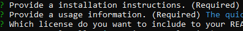
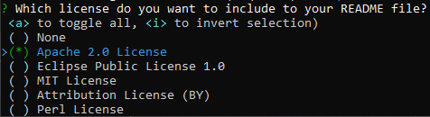
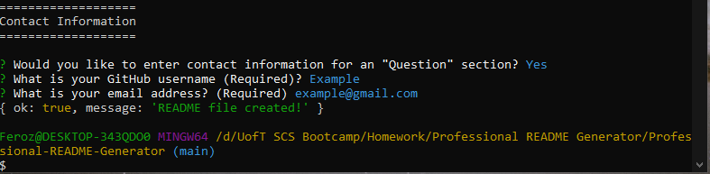

# Professional-README-Generator

[](https://opensource.org/licenses/MIT)

## Description

This is a command-line application for generating professional README file. You just have to answer some questions and get README file ready!

## Table of Contents

- [Installation](#installation)
- [Usage](#usage)
- [License](#license)
- [Questions](#questions)

## Installation

1. Install Node.js (https://nodejs.org/en/download/)
2. ```bash
   git clone git@github.com:/FalconView/Professional-README-Generator/blob/main/assests/images/READMEgenerator_screen_recording.gif
   ```
3. ```bash
   npm install inquirer
   ```

## Usage

1. Start creating file by the following command:
   ```bash
   npm start
   ```
2. Answer questions in the terminal.</br> </br>
   [Demonstration Video](https://drive.google.com/file/d/1EPepTBmyK6YVwuhGv-R1sx1m1C7BZb-N/view?usp=sharing)
   - For "Required" questions, if no answer provided, it will give you error until you answer the question.
     
     
   - Press "Enter" to skip questions that are not required.
   - If you enter "no" for contact information, you will not be asked any further questions.
     
3. Copy the `README.md` created in `dist` folder into your project's folder and check the outcome!

## License

Licensed under the [MIT License](https://opensource.org/licenses/MIT).

## Questions

- GitHub Profile: https://github.com/FalconView
- If you have any additional questions, please feel free to contact me by email.
  E-mail Address: <Ferozzargar@hotmail.com>
